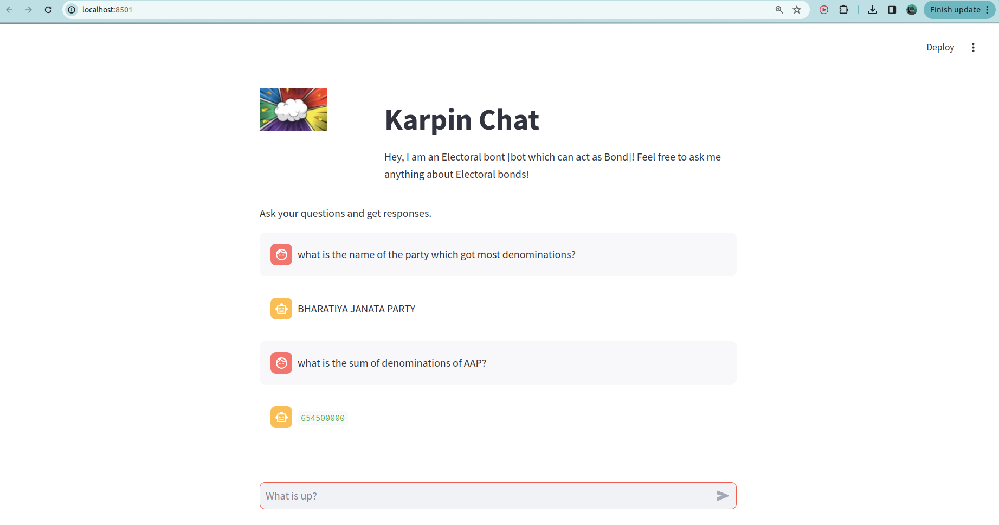

# Karpin Chat

This repository contains a chatbot that answers questions related to electoral bonds. The chatbot can be run as a Python script or deployed as a Streamlit application.

## Setup Instructions

### Create a Conda Environment

First, create and activate a new conda environment:

```bash
conda create -n electoral_bonds_chatbot python=3.10
conda activate electoral_bonds_chatbot
```

### Install Requirements

Install the required packages using the requirements.txt file:

```bash
pip install -r requirements.txt
```

### Running the PDF to CSV script

Change the _pdf_path_ and _csv_path_ in _pdf_2_csv.py to generate the csv from pdf file.

```bash
python pdf_2_csv.py
```

### Running the Python Script

To run the Python script, make sure that questions.txt is present in the existing directory. This script will read the questions from questions.txt and generate answers in answers.txt.

```bash
python script.py
```

### Deploying the Application Locally

To deploy the chatbot as a Streamlit application locally, run the following command:

```bash
streamlit run chat_app.py
```

### Screenshot of the Application

